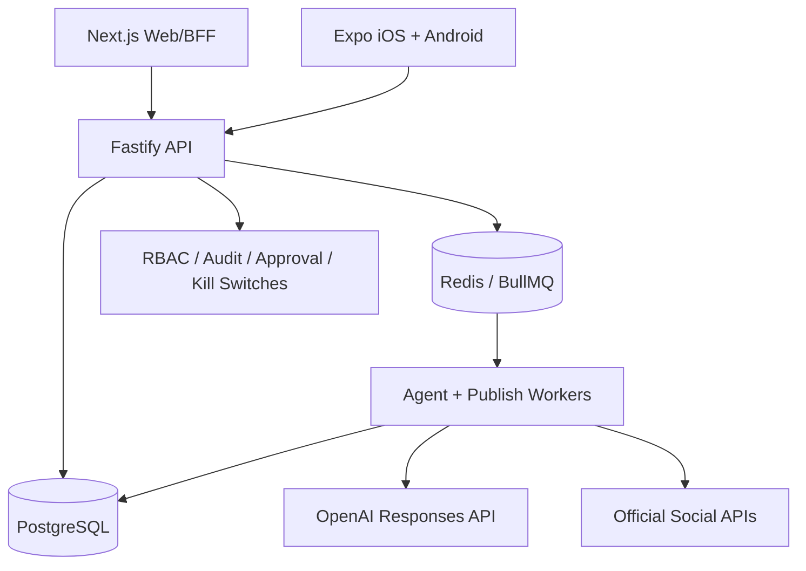

# Architecture

## Trust boundaries

**Web** never receives social-account credentials. It stores Spheric access/refresh tokens in HttpOnly cookies and proxies application calls through its same-origin BFF. **Mobile** talks directly to the API and stores the small Spheric session in Keychain/Android Keystore through Expo SecureStore. **API** is the authorization and tenancy authority. **Workers** are the only components that decrypt social credentials or call LLM/social APIs. **PostgreSQL** owns durable state; **Redis/BullMQ** owns delivery, delay scheduling and distributed job coordination.

## Tenant/integrity model

Every operator request is scoped through organization membership. Brands belong to organizations; campaigns and accounts belong to brands. The API checks that a content item's social account belongs to the same brand and platform, and PostgreSQL migration `003_integrity.sql` enforces that relationship again with a trigger. The publish worker independently joins the account back to the campaign brand/platform before decrypting credentials.

## Campaign flow

1. Operator defines objective, audience, platforms, date window and approval requirement.
2. `generate-campaign` loads brand voice/knowledge plus enabled strategy/copywriter agent guidance.
3. OpenAI produces the exact requested number of platform-native candidates using `store:false`.
4. Enabled compliance-agent guidance reviews each candidate. Disallowed content is rejected; medium/high-risk content or approval-required campaigns stay `pending_approval`.
5. Candidates are inserted in one DB transaction after AI/review work completes. A matching connected account is assigned only when available.
6. Approved low-risk content with a valid account is scheduled across the campaign window. BullMQ delayed jobs are deterministic per content item.
7. At execution time the worker verifies campaign state, content state, account brand/platform match and the account-level `posting_enabled` kill switch.
8. Credentials are decrypted in worker memory only for the outbound official-API call. External IDs/URLs or failure details are persisted.

Pausing a campaign removes its delayed jobs but preserves scheduled state. Resuming reconstitutes delayed jobs from PostgreSQL, so Redis is not treated as the source of truth. Disabling an account similarly removes scheduled jobs assigned to it; re-enabling it reconstructs eligible jobs.

## Research/trend flow

On-demand or optional scheduled research loads the enabled research/strategy agent instructions and brand knowledge. The OpenAI Responses API web-search tool creates a source-aware briefing stored in `research_briefs`. `knowledge_base.researchQueries` controls recurring topics when `AUTO_RESEARCH_ENABLED=true`.

## Analytics

`analytics_snapshots` and the web/mobile summaries are implemented. The worker has an analytics job boundary but deliberately does not pretend that one cross-platform metrics API exists: production metric ingestion must be enabled per provider after the deploying organization receives the relevant insights/analytics scopes. See `SOCIAL_CONNECTORS.md`.
